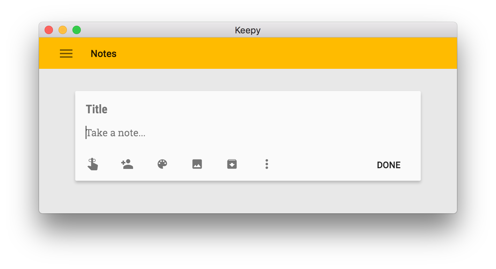

# Keepy

> A cute little write-only Google Keep app, that allows to take notes on laptop/desktop (this isn't keepy.me :) )



## Download and Install

- [Mac OS X 64-bit](https://github.com/ryanseys/keepy/releases/download/1.0.0/Keepy-darwin-x64.zip)
- [Linux 64-bit](https://github.com/ryanseys/keepy/releases/download/1.0.0/Keepy-linux-x64.zip) 
- [Linux 32-bit](https://github.com/ryanseys/keepy/releases/download/1.0.0/Keepy-linux-ia32.zip) 
- [Windows 64-bit](https://github.com/ryanseys/keepy/releases/download/1.0.0/Keepy-win32-x64.zip)
- [Windows 32-bit](https://github.com/ryanseys/keepy/releases/download/1.0.0/Keepy-win32-ia32.zip) 

## Install from source

```bash
# Clone this repo
git clone https://github.com/ryanseys/keepy

# Go into the repo
cd keepy

# Install deps and run the app
npm install && npm start
```

## Icon credit

Icon graciously provided by [Pacifica Icons][icon-link].

[icon-link]: http://www.iconarchive.com/show/pacifica-icons-by-bokehlicia/google-keep-icon.html

## Disclaimer

This is not an official Google product.

## License

Copyright 2016 Google Inc. All Rights Reserved.

Licensed under the Apache License, Version 2.0 (the "License");
you may not use this file except in compliance with the License.
You may obtain a copy of the License at

     http://www.apache.org/licenses/LICENSE-2.0

Unless required by applicable law or agreed to in writing, software
distributed under the License is distributed on an "AS IS" BASIS,
WITHOUT WARRANTIES OR CONDITIONS OF ANY KIND, either express or implied.
See the License for the specific language governing permissions and
limitations under the License.
